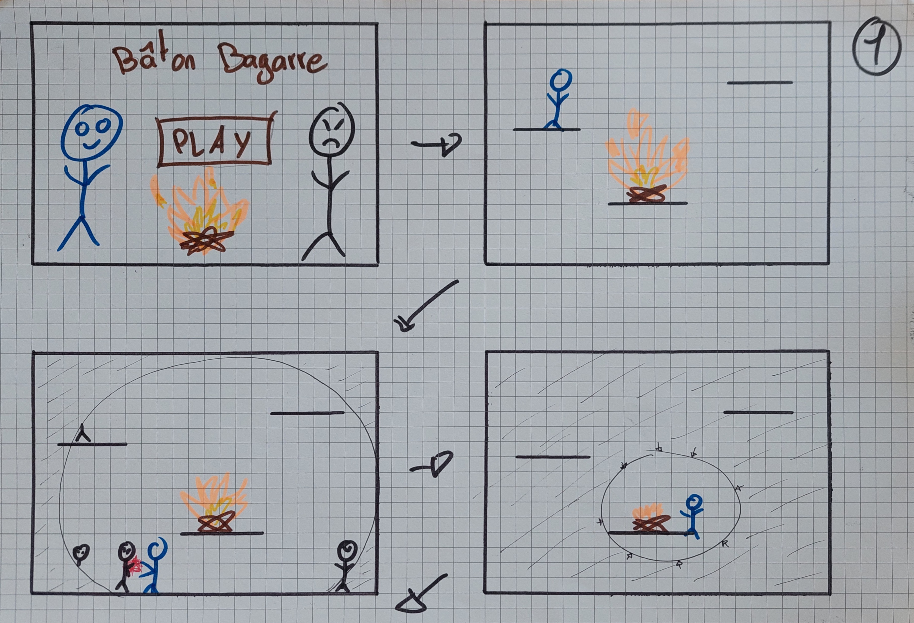
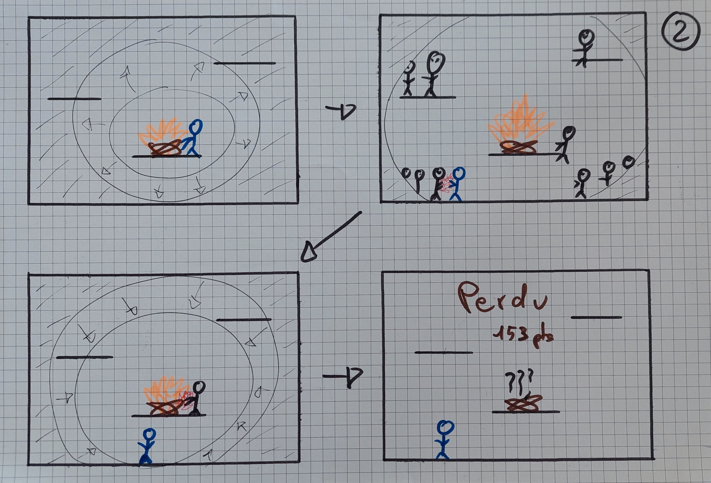

# Bâton Bagarre

## Description du Projet

**Bâton Bagarre** est un jeu d'action en 2D développé en Python à l'aide de la bibliothèque PyGame. Le jeu met en scène un stickman dont l'objectif est de protéger un feu de divers ennemis qui tentent de l'éteindre. Le feu s'éteint progressivement, réduisant la visibilité du joueur. Le stickman peut raviver le feu en intéragissant avec, mais cela prend du temps et doit également combattre les ennemis pour les empêcher de détruire le feu.

### Objectif

Le but principal du jeu est de survivre le plus longtemps possible en gardant le feu allumé. Le jeu se termine lorsque le feu est complètement éteint, et la visibilité est réduite à zéro. Le joueur doit donc jongler entre combattre les ennemis et réparer le feu pour maintenir une zone de lumière suffisante.

## Installation et lancement

1. Pour pouvoir lancer le jeu il vous faut python version supérieure à 3.12

2. Telechargez l'archive la plus récente

3. Decompressez l'archive dans le repertoire de votre choix

4. Dans un terminal, naviguez jusqu'à l'emplacement de l'archive décompresée

5. Executez la commande suivante

    `python run.py`

6. Cela va initialiser un nouvel environnement python, installer les dependances puis executer le jeu

## Test

Pour lancer les test il vous suffit d'utiliser la commande 

`python test.py`

## Requirements Fonctionnels

1. **Gestion du Feu :**
    - Le feu doit réduire de taille au fil du temps.
    - Le stickman peut raviver le feu en intéragissant avec, à condition qu'il ne soit pas complètement éteint.
    - Si le feu est complètement éteint, il n'est pas possible de le rallumer et le jeu se termine.

2. **Ennemis :**
    - Les ennemis doivent apparaître et se diriger vers le feu.
    - Les ennemis doivent pouvoir être éliminés par le stickman.
    - Le nombre et la puissance des ennemis doit augmenter en difficulté au fil du temps.
    - Si un ennemi attaque le feu, l'intensité du feu diminuera par acoups très rapidement.

3. **Stickman :**
    - Le stickman doit être contrôlable par le joueur.
    - Le stickman doit pouvoir se déplacer et attaquer les ennemis.
    - Le stickman doit pouvoir réparer le feu en intéragissant avec.
    - Le stickman est invincible.

4. **Effet de Lumière :**
    - La zone de lumière visible doit diminuer à mesure que le feu s’éteint.
    - Les bords de l'écran doivent devenir progressivement plus sombres en fonction de l'intensité du feu.

5. **Interface Utilisateur :**
    - Afficher un compteur de temps ou un score indiquant combien de temps le joueur a survécu.
    - Indiquer visuellement le temps de vie restant du feu.

## Requirements Non-Fonctionnels

1. **Performance :**
    - Le jeu doit fonctionner de manière fluide sur des machines ayant des spécifications minimales pour PyGame.
    - Les animations doivent être fluides et ne pas entraîner de ralentissements notables.

2. **Ergonomie :**
    - Les contrôles du stickman doivent être intuitifs et réactifs.
    - L'interface utilisateur doit être claire et facile à comprendre pour le joueur.

3. **Portabilité :**
    - Le jeu doit être exécutable sur les principales plateformes (Windows, macOS, Linux) sans modifications importantes.

4. **Documentation :**
    - La documentation du code et du jeu doit être complète et bien structurée pour faciliter les futurs développements et la maintenance.

## Choix Techniques
Lorsque nous avons décidé de développer notre jeu de stickman avec Pygame, plusieurs facteurs techniques ont guidé notre choix. Voici pourquoi Python et Pygame étaient les meilleures options pour notre projet :

1. **Accessibilité et simplicité de Python** : 
Python est un langage reconnu par sa syntaxe claire et lisible, ce qui en fait un langage de programmation idéal pour les développeurs de tous les niveaux.

2. **Richesse de la bibliothèque PyGame** : 
PyGame est une bibliothèque Python spécialement conçue pour le développement de jeux. Elle fournit une série d'outils pour gérer les graphiques, les sons et les entrées utilisateurs. Avec cette bibliothèque on peut facilement implémenter les éléments essentiels d'un jeux vidéo comme les collisions, les animations et les contrôles, tout en bénéficiant d'une bonne performance graphique.

3. **Flexibilité et portabilité** : 
Python est un langage multiplateforme, et Pygame est compatible avec Windows, macOS, et Linux. Cette portabilité nous permet de développer et de tester notre jeu sur différents systèmes d'exploitation, garantissant ainsi une expérience cohérente pour tous les joueurs.

4. **Coût et accessibilité** : 
Python et PyGame sont tous les deux gratuits et open-source, cela réduit les coût de réalisation du projet à 0 et rend les outils accessibles à tout développeur, peu importe le budget.

## Processus de travail
1. **Idéation et Conceptualisation** : 
Le processus a débuté par une phase de brainstorming où nous avons exploré différentes idées de projet à réaliser pendant ces 3 semaines. On était partis de la base de créer un jeu de combat de stickman en local. Après plusieurs discussions, nous avons opté pour un concept de défense de base tout en gardant le concept de stickman, mais avec la "Killer feature" où la vie du feu (objet à défendre) affecte directement la visibilité du joueur, ajoutant une dimension stratégique au jeu.

 2. **Planification et Conception** : 
Une fois l'idée de base définie, nous avons établi un plan de développement détaillé. Cette phase comprenait la création des Mokups pour le jeu, la définition des principales mécaniques de jeu et la répartition des tâches à réaliser pour celui-ci sur un [Trello](https://trello.com/b/7f2iohaa/pdg24-baton-bagarre) crée pour le groupe . Nous avont également identifié les ressources nécessaires, telles que les assets graphiques, les sons, et les outils de développement.

3. **Prototypage** : 
Nous avons ensuite réalise un prototype fonctionnel qui nous permet de tester les principales mécaniques du jeu. On a aussi crée le "Landing page" qui permet de "vendre" le jeu aux clients.

4. **Développement iteratif** : 
Pour le développement nous avons suivi une approche itérative, ce qui signifie que nous avons développé le jeu par petites étapes, en testant et ajustant continuellement chaque fonctionnalité.

## Description de l'architecture
L'intégralité du projet consiste en un programme Python, ce qui signifie qu'il n'y a aucun autre élément à gérer, comme des serveurs ou des bases de données. Toutes les fonctionnalités sont encapsulées dans des classes, chacune étant répartie dans différents fichiers. Le fichier principal, `Game.py`, contient la boucle du jeu et assure la gestion des éléments principaux de celui-ci.

## Créer une nouvelle version du jeu
 
Nous avons créer un workflow GitHub Actions configuré pour créer une nouvelle release contenant une archive zip avec uniquement les fichiers nécéssaire au jeu.
 
Pour la déclencher, rien de plus simple, il faut :
 
1. **Créer un tag** : Utilisez la commande suivante pour créer un tag avec un numéro de version (par exemple, `v1.0.0`).
 
    ```bash
    git tag v1.0.0
    ```
 
2. **Pousser le tag vers le dépôt distant** : Envoyez le tag créé vers le dépôt GitHub.
 
    ```bash
    git push origin v1.0.0
    ```
 
Cela déclenchera le workflow et créera une nouvelle release nommée "Release v1.0.0" avec le fichier ZIP généré et attaché automatiquement à cette release.

## Mockups

1. **Menu Principal** : Il est la première interface que le joueur voit lorsqu'il lance le jeu. Il permet de lancer une nouvelle partie.
2. **Début du jeu** : L'écran de jeu principal, où le joueur contrôle le stickman et défend le feu.
3. **Ennemis** : Les ennemis apparaissent de l'extérieur de l'écran et se dirigent vers le feu. Le joueur doit les éliminer avant qu'ils n'atteignent le feu. La luminosité diminue à mesure que le feu s'éteint.
4. **Feu** : L'objet à défendre. Sa taille diminue au fil du temps.


1. **Raviver le feu** : Le joueur peut "réparer" le feu en intéragissant avec. Cela prend du temps et le joueur doit être vigilant pour ne pas être attaqué par les ennemis.
2. **De nouvelles vagues d'ennemis** : Les ennemis apparaissent en vagues, de plus en plus nombreux et puissants.
3. **Dégâts au feu** : Si un ennemi attaque le feu, l'intensité du feu diminue rapidement.
4. **Fin du jeu** : Le jeu se termine lorsque le feu est complètement éteint. Le joueur peur voir son score.

## Landing page

🔥 **Protégez le feu, sauvez l'avenir !** 🔥

Plongez dans une bataille palpitante avec notre nouveau jeu de stickman où votre objectif est de défendre un précieux feu contre des vagues incessantes d'ennemis. Chaque attaque diminue non seulement la vie du feu, mais aussi la visibilité de l'écran, rendant chaque seconde cruciale!

✨ **Êtes-vous prêt à relever le défi ?** ✨

Rejoignez-nous maintenant et testez vos compétences dans cette aventure intense ! Découvrez plus sur notre landing page et préparez-vous à sauver le feu avant qu'il ne soit trop tard.

👉 <a href="https://raynobrak.github.io/baton-bagarre-game" target="_blank">Découvrez le jeu ici !</a>


